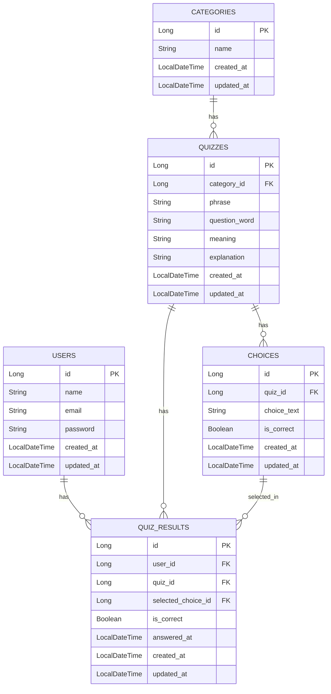

```mermaid
erDiagram
    CATEGORIES ||--o{ QUIZZES : has
    QUIZZES ||--o{ CHOICES : has
    USERS ||--o{ QUIZ_RESULTS : has
    QUIZZES ||--o{ QUIZ_RESULTS : has
    CHOICES ||--o{ QUIZ_RESULTS : selected_in

    CATEGORIES {
        Long id PK
        String name
        LocalDateTime created_at
        LocalDateTime updated_at
    }

    QUIZZES {
        Long id PK
        Long category_id FK
        String phrase
        String question_word
        String meaning
        String explanation
        LocalDateTime created_at
        LocalDateTime updated_at
    }

    CHOICES {
        Long id PK
        Long quiz_id FK
        String choice_text
        Boolean is_correct
        LocalDateTime created_at
        LocalDateTime updated_at
    }

    USERS {
        Long id PK
        String name
        String email
        String password
        LocalDateTime created_at
        LocalDateTime updated_at
    }

    QUIZ_RESULTS {
        Long id PK
        Long user_id FK
        Long quiz_id FK
        Long selected_choice_id FK
        Boolean is_correct
        LocalDateTime answered_at
        LocalDateTime created_at
        LocalDateTime updated_at
    }
```
